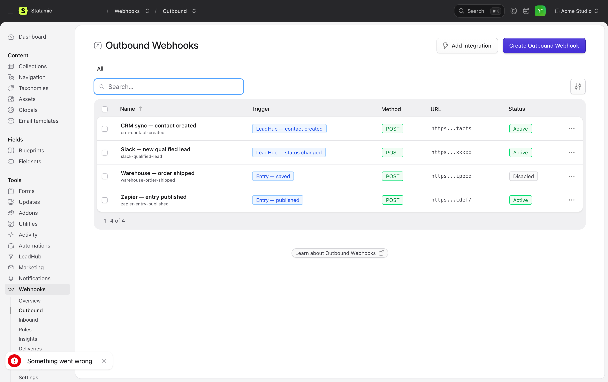
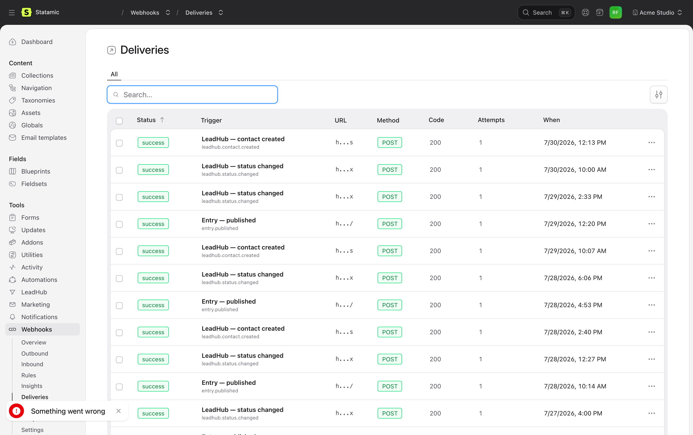
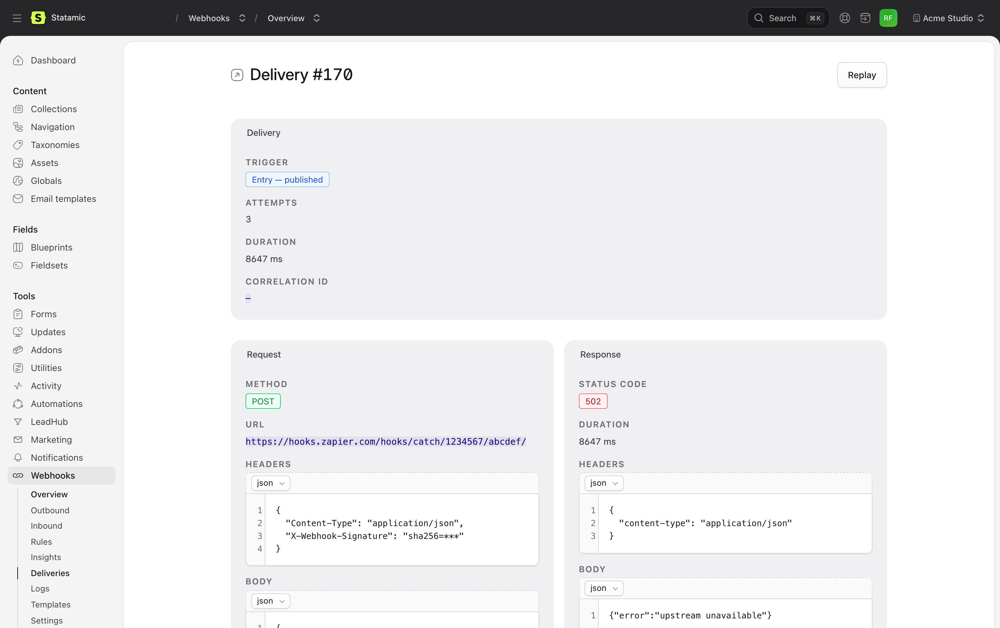
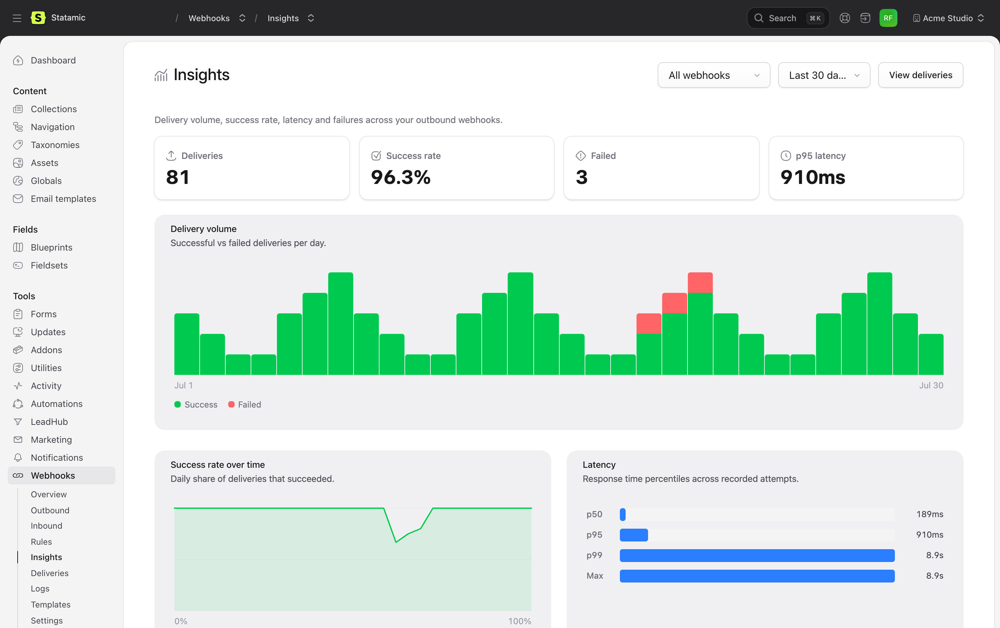

<p align="center">
  
</p>

# Statamic Webhook Manager

A central, CP-native integration layer for **[Statamic 6](https://statamic.com/)**. Manage **outbound webhooks**, **inbound endpoints**, **deliveries**, **retries**, **replays**, **rules** and **templates** — all from one place inside the Control Panel.

> **Status:** Stable on Statamic 6 (Laravel 12/13). Outbound webhooks, the delivery engine with retries & replay, inbound endpoints, the rule engine, payload templates and the full Vue + Inertia Control Panel are implemented and covered by the test suite.

---

## Features

- **Outbound webhooks** triggered by Statamic events (entry/form/user/asset) with conditional execution, payload templates, header & auth control, retry policies and queue-first delivery.
- **Integration presets** — guided "pick a destination → fill a URL" setup for Slack, Discord, Microsoft Teams, Zapier, Make, n8n and generic JSON, so you never hand-write a payload template.
- **Delivery snapshots** with full request/response bodies, status, error classification, attempts, retry schedule and replay support.
- **Replay** failed deliveries individually or in batches, optionally re-rendering against current data.
- **Failure alerting & circuit breaker** — email + Slack alerts (throttled per hook) when a delivery fails for good, and automatic disabling of a hook after too many consecutive failures.
- **Insights dashboard** — delivery volume, success-rate trend, latency percentiles (p50/p95/p99), error breakdown and top-failing endpoints, with day-range and per-webhook filters.
- **"Send webhook" entry action** — fire any enabled outbound webhook for selected entries straight from the native CP action toolbar.
- **Auth schemes**: none, bearer token, basic auth, custom header, HMAC SHA256 signature, IP allowlist (single addresses and CIDR ranges).
- **Inbound rate limiting** — a per-endpoint requests-per-minute cap, enforced before authentication, answering 429 with `Retry-After`.
- **Token-based template renderer** (`{{ entry:title }}`, `{{ system:timestamp_iso }}`, …) with variable resolver registry.
- **Pluggable storage driver** — keep webhook config in the database, or as human-readable, git-versionable YAML under `content/webhooks/` (delivery history always stays in the database).
- **Permissions** for granular access to outbound config, sensitive payloads, replays, debug tools.
- **Native Statamic 6 CP** — built with Vue 3, Inertia.js and Statamic's `@ui` component library; fits seamlessly into the CP look & feel.

## Screenshots

| | |
|---|---|
| <br>**Outbound** — which events fire which requests, and whether they are healthy | <br>**Deliveries** — status, error classification and attempt count |
| <br>**Delivery snapshot** — full request and response, replayable with one click | <br>**Insights** — volume, success rate and failures over time |

## Requirements

- PHP **8.2+**
- Statamic **6.0+**
- Laravel **12 or 13**
- Node **18+** (only needed if you rebuild the CP bundle from source)
- A queue driver other than `sync` is strongly recommended.

## Installation

```bash
composer require goldnead/statamic-webhook-manager
php please vendor:publish --tag=webhook-manager-config
php artisan migrate
```

The Webhook Manager appears in the CP sidebar as **Webhooks**.

> **Note:** The pre-built CP bundle (`resources/dist/build/`) ships with the package. If you cloned the repo directly (e.g. via path repository) you'll need to build it yourself:
>
> ```bash
> npm install
> npm run build
> ```

## Configuration

See `config/webhook-manager.php` after publishing — feature toggles, retry policy, logging mode, masking rules, route prefixes, alerting/circuit-breaker, storage driver, etc.

### Storage driver

Webhook **configuration** (outbound webhooks, inbound endpoints, rules, templates) can be stored two ways. Delivery records and logs are runtime telemetry and always live in the database.

```php
// config/webhook-manager.php
'storage' => [
    'driver' => env('WEBHOOK_MANAGER_DRIVER', 'eloquent'), // 'eloquent' | 'flat'
    'flat' => [
        'path' => env('WEBHOOK_MANAGER_FLAT_PATH', base_path('content/webhooks')),
    ],
],
```

- **`eloquent`** (default) — config lives in database tables. Run `php artisan migrate`.
- **`flat`** — config lives as human-readable YAML under `content/webhooks/`, git-versionable alongside the rest of your site.

You can switch the active driver **in the Control Panel** (Settings → Storage) — it migrates the existing config to the target store and activates it, no `.env` access needed. A Control-Panel choice is persisted under `storage/` and takes precedence over the config/env default.

Or do it from the CLI (records are copied id-for-id either way):

```bash
php artisan webhook-manager:storage:migrate --from=eloquent --to=flat --dry-run
php artisan webhook-manager:storage:migrate --from=eloquent --to=flat
```

### Retries

A delivery that fails on a retryable status (or a network error) gets a `next_retry_at` from the retry policy — `none`, `linear` or `exponential`, capped at `max_delay_seconds`, up to `max_attempts`.

Those retries are executed by `webhook-manager:dispatch-retries`, which the addon puts on the scheduler itself, once a minute. **Your site needs the standard Laravel scheduler cron** — the one every Laravel install already has:

```
* * * * * cd /path/to/site && php artisan schedule:run >> /dev/null 2>&1
```

Without that cron, deliveries will sit at "next retry in …" forever. If you would rather drive the command yourself, set `webhook-manager.retry.schedule` to `false`.

A retry is claimed before it runs, so two overlapping scheduler runs cannot turn one planned attempt into two. Once a delivery is out of attempts it stops being scheduled, the circuit breaker records the failure and the failure alert goes out.

### The inbound endpoint URL

```
https://your-site.test/webhooks/inbound/{brand}/{handle}
```

The brand segment is part of the URL on every install, single-brand ones
included. It is what the Control Panel prints on the endpoint's page, and it is
what you paste into the sender's webhook field.

**Why the brand is in the path.** Inbound endpoints are brand-scoped like
everything else in this addon, and the brand scope fails closed: with no current
brand a query returns no rows. Every other route resolves the brand from
something the caller carries — a CP session, a bearer token, a link token. A
webhook sender carries none of those. It is Scaleway or Stripe or n8n, and it
holds a URL. So the URL has to say it. Until 2.1.0 it did not, and a multi-brand
install answered **every** inbound delivery with `404 Endpoint not found or
disabled` while the endpoint sat there, enabled.

The short form stays routable:

```
https://your-site.test/webhooks/inbound/{handle}
```

It resolves to the **default** brand, which is where the brand-scoping migration
put every endpoint that existed before brands did — so a site that switches
`brand-context.multi_brand` on keeps the senders that worked before it switched.
It deliberately does not search the other brands: `handle` is unique per brand,
not globally, so that search would have to guess as soon as two brands pick the
same name, and a webhook config is a destination plus the credential that
authenticates it. An endpoint belonging to any other brand is reachable only
through its brand-qualified URL.

A brand segment naming a brand that does not exist gets the same `404` as an
unknown endpoint handle, so the URL cannot be used to find out which brands an
installation has.

### Signature and replay

An inbound endpoint is a public URL. Two things keep it from being an open door,
and both are worth setting deliberately:

- **Authentication** runs before parsing, mapping or any action — step 4 of the
  pipeline, right after the rate limit and the size check. `hmac` is the scheme
  to want; `static_header`, `bearer`, `basic` and `ip_allowlist` are there for
  senders that offer nothing better. A rejected request gets `401` and is logged
  as `inbound_auth_failed`.
- **Replay protection** (`replay_protection_enabled`) rejects a delivery that
  has already been seen inside the TTL window with `409`. It keys on
  `Idempotency-Key`, else the signature header, else a hash of the body, always
  per endpoint. **New endpoints have it on since 2.1.0** — every serious sender
  retries on a timeout it cannot tell apart from a failure, and without this the
  action runs twice. Existing endpoints keep what they were saved with.

One thing the defaults cannot do for you: `require_timestamp` in an HMAC
endpoint's `auth_config`. Without it the signature covers a body and nothing
else, and a signature that says nothing about *when* it was made never expires —
anyone who has ever seen one valid delivery can send it again next year. The
replay cache closes its own window (ten minutes by default) and not a second
more. It is not switched on for you because a sender that does not send the
timestamp header would start failing on upgrade; instead every delivery to an
HMAC endpoint without it is logged as `inbound_signature_without_timestamp`.
Turn it on as soon as the sender is known to send the header:

```json
{ "secret": "…", "algorithm": "sha256", "require_timestamp": true, "timestamp_tolerance_seconds": 300 }
```

### Inbound rate limiting

An inbound endpoint accepts a fixed number of requests per minute. The limit is checked first, before the method allowlist and before authentication, so a flood cannot be used to make the site do work.

```php
// config/webhook-manager.php
'inbound' => [
    'rate_limit_per_minute' => 60, // 0 disables throttling
],
```

- The counter is keyed **per endpoint**, so one noisy sender cannot take the other endpoints down with it, and the legacy `!/webhooks/inbound` prefix shares the bucket with the canonical URL rather than offering a way around the limit.
- Exceeding the limit answers **429** with a `Retry-After` header. Every response — accepted or rejected — carries `X-RateLimit-Limit` and `X-RateLimit-Remaining`, so a well-behaved sender can slow down before it is rejected.
- A single endpoint can override the global default via its `rate_limit_config`:

  ```json
  { "per_minute": 600 }
  ```

- Throttled requests are logged as `inbound_rate_limited` and are visible in the CP log, so a limit does not look like an outage.

### IP allowlist

`ip_allowlist` is one of the inbound auth schemes. It accepts single addresses and CIDR ranges, IPv4 and IPv6:

```json
{ "ips": ["203.0.113.9", "192.168.10.0/24"] }
```

It fails closed: an endpoint with an empty or missing allowlist rejects every request. Behind a proxy or load balancer, configure Laravel's `TrustProxies` — otherwise `$request->ip()` is your proxy's address and no allowlist will ever match.

### Failure alerting

Set recipients (and an optional Slack webhook) so an admin is notified when a delivery fails after all retries; alerts are throttled per hook. A hook is auto-disabled after `circuit_breaker.threshold` consecutive terminal failures.

```dotenv
WEBHOOK_MANAGER_ALERT_EMAILS="ops@example.com,team@example.com"
```

## Concepts

- **Outbound webhook** — config for an HTTP request fired by an internal trigger.
- **Trigger** — internal event (e.g. `entry.published`, `form.submitted`).
- **Delivery** — one attempt to deliver a webhook, with full snapshot.
- **Rule** — `When → If → Then` flow with conditions and actions.
- **Inbound endpoint** — stable HTTPS URL receiving and validating external requests.

### Integration presets

Rather than hand-writing a Slack or Discord payload, pick the destination and fill in a URL. Presets ship for Slack, Discord, Microsoft Teams, Zapier, Make, n8n and generic JSON; each one creates a normal outbound webhook with a working payload template you can then edit like any other. CP → Webhooks → Integrations.

### Rules

A rule is a `When → If → Then` flow: an incoming trigger (a Statamic event or an inbound webhook), an optional condition tree with AND/OR groups, and an ordered list of actions — send an outbound webhook, create or update an entry, create a form submission, dispatch an event, send an email or a Slack message, set a field, write a log note. Conditions and actions are registry-driven, so a site can add its own (see [Extending](#extending)).

Rules are the layer between "something happened" and "these requests go out", without a listener class.

### Templates

A template is a reusable payload body, referenced by handle from any number of outbound webhooks. The body is rendered with token variables (`{{ entry:title }}`, `{{ system:timestamp_iso }}`, …) that are resolved from the trigger payload at delivery time. Attach one to a webhook so several webhooks can share a single payload shape; deleting a template detaches the webhooks using it and they fall back to their inline body.

## Usage example

1. CP → Webhooks → Outbound → Create.
2. Pick trigger `entry.published`, scope to a collection.
3. Set destination URL, method and HMAC secret.
4. Use the JSON template editor:

```json
{
  "id": "{{ entry:id }}",
  "title": "{{ entry:title }}",
  "site": "{{ site:handle }}",
  "updated_at": "{{ system:timestamp_iso }}"
}
```

5. Save, publish a test entry, watch it appear under **Deliveries**.

## Extending

The addon is intentionally registry-driven. Register your own from any service provider:

```php
use Goldnead\WebhookManager\Facades\WebhookManager;

WebhookManager::registerTrigger(new MyCustomTrigger());
WebhookManager::registerCondition(new MyCustomCondition());
WebhookManager::registerAction(new MyCustomAction());
WebhookManager::registerAuthScheme(new MyCustomAuthScheme());
WebhookManager::registerVariableResolver(new MyCustomResolver());
WebhookManager::registerSuccessEvaluator(new MyCustomEvaluator());
```

Each registry has its own contract under `Goldnead\WebhookManager\Contracts`.

### Custom event triggers (any event class)

Out of the box the addon reacts to a fixed set of Statamic events (entry
saved/published/…, form submitted, user saved, asset saved). If you want **any
other** Laravel or Statamic event — your own domain events or a third-party
addon's — to fire webhooks, register it as a *custom event trigger*. No listener
class required: the addon attaches one generic listener that normalises the
event into the standard dispatch pipeline, and the trigger shows up in the CP
trigger picker (Outbound + Rules) automatically.

**Config-driven** — add entries to the `event_triggers` map in
`config/webhook-manager.php`. The array key is the trigger handle (unless you set
`handle` explicitly):

```php
'event_triggers' => [
    'order.shipped' => [
        'event'       => \App\Events\OrderShipped::class, // FQCN to listen for (required)
        'label'       => 'Order — shipped',               // shown in the CP picker
        'source_type' => 'order',                         // optional, default "event"
        'description' => 'Fires when an order ships',      // optional
        // Optional payload mapper: Closure, invokable class-string, or [class, method].
        // Omit it to serialise the event via toArray()/public properties.
        'payload'     => \App\Webhooks\OrderShippedPayload::class,
    ],
],
```

A `payload` class is just an invokable that maps the event to an array:

```php
class OrderShippedPayload
{
    public function __invoke(\App\Events\OrderShipped $event): array
    {
        return ['id' => $event->order->id, 'total' => $event->order->total];
    }
}
```

**Programmatic** — register the same thing in code from your service provider's
`boot()` method (e.g. to ship a preconfigured trigger with your own addon). It
funnels into the exact same generic listener + registry registration as the
config path:

```php
use Goldnead\WebhookManager\Facades\WebhookManager;

WebhookManager::registerEventTrigger(\App\Events\OrderShipped::class, [
    'handle'      => 'order.shipped',
    'label'       => 'Order — shipped',
    'source_type' => 'order',
    'payload'     => fn (\App\Events\OrderShipped $e) => ['id' => $e->order->id],
]);
```

When no `payload` mapper is given, the listener builds the payload from the
event's `toArray()` if present, otherwise its public properties (and passes
through an event that is already an array).

### Load order & overwriting

Register from the `boot()` method of your own service provider. Statamic boots
addon providers before application providers, so by the time your `boot()`
runs the Webhook Manager registries exist and are seeded with the built-in
defaults. Registering from `register()` (or before this addon boots) is not
supported.

Registries are keyed by handle: registering a trigger, condition, action,
auth scheme, resolver, evaluator, preset or inbound action handler whose
`handle()` matches an existing one **replaces** it. That is the supported way
to override a built-in — but pick unique handles for genuinely new
registrations to avoid clobbering defaults.

### Boundary vs. `goldnead/statamic-automations`

- **Webhook Manager is the transport layer**: it delivers and receives HTTP
  hooks, with retries, signing/auth, templates and delivery logging.
- **Automations is the orchestration layer**: it runs multi-step workflows
  (conditions, delays, branching) and can send webhooks *through* Webhook
  Manager as one of its steps.

Both addons can react to the same Statamic events (e.g. `EntrySaved`). Pick
one place per concern: if an automation already fires a webhook for an event,
don't also configure a Webhook Manager trigger for that same event and
destination — you will double-fire.

## Architecture

- **Controllers** return `Inertia::render('webhook-manager::Page/Name', $props)` — they never render Blade for the CP.
- **Vue pages** live under `resources/js/pages/` and are registered to Inertia in `resources/js/cp.js` via `Statamic.$inertia.register(...)`.
- **Service Provider** ships a `$vite` configuration so Statamic loads the addon's bundled JS/CSS in the CP.
- **Build** uses Vite + the `@statamic/cms/vite-plugin` to consume Statamic's `dist-package` (`@statamic/cms/ui`, `@statamic/cms/inertia`).
- **Domain layer** (controllers, models, services, jobs, queue) is pure Laravel — no Vue, no Inertia coupling. The same code path serves both async deliveries and the CP test button.

## Roadmap

Forward-looking design questions that may evolve in future releases:

1. Antlers/Tokens vs. a dedicated mini-template language.
2. Whether outbound hooks are modeled as specialised rules or kept separate.
3. How editable replay snapshots should be.
4. Whether inbound directly writes content or always goes through the action layer.
5. Final extensibility API surface.

## Console commands

- `php please webhook-manager:dispatch-retries` — run the deliveries whose scheduled retry is due. Registered on the scheduler automatically (every minute); you only need the standard Laravel `schedule:run` cron.
- `php please webhook-manager:prune` — purge old deliveries/logs.
- `php please webhook-manager:replay-failed` — bulk replay failures from the last N hours.
- `php please webhook-manager:health` — show counts and recent failures.
- `php please webhook-manager:seed-examples` — install sample fixtures.
- `php please webhook-manager:storage:migrate --from=… --to=…` — move config between the `eloquent` and `flat` storage drivers.

## Testing

```bash
composer install
composer test          # or: vendor/bin/phpunit
```

Feature tests cover the outbound delivery flow, failure logging, replay,
inbound dispatch & signature verification, rule execution, template CRUD and
permission masking; unit tests cover the renderer, mapper, condition/rule
engines, retry planner and HMAC verifier.

### Component tests (Vitest)

```bash
npm install
npm test               # or: npx vitest run   /   npx vitest  (watch)
```

The Control Panel is a Vue SPA, and until 1.6.0 nothing in this package could
execute a line of it. PHPUnit reaches the controller and the props it hands
over; the QA harness clicks through the finished screen. Between the two sat
the component logic — and that is where a Content-Type header that arrives as
a PSR-7 **array** instead of a string took down an entire panel without
anything reporting an error.

Vitest closes that gap. It is deliberately narrow:

- **What belongs here:** logic inside a component — header parsing, mode
  detection, computed fallbacks, the shape of what a component is handed.
- **What does not:** navigation, saving, permissions end to end, anything
  crossing into PHP. Those are feature tests or the QA harness.

Setup notes, in case something fails at an import rather than at an assertion:

- Vitest reads the same `vite.config.js`. Under `VITEST` the Statamic Vite
  plugin is swapped for the plain Vue plugin, because the former rewrites
  `vue` to `window.Vue` — correct for the CP bundle, fatal in a test process.
- `@statamic/cms/ui` and `@statamic/cms/inertia` are re-export shims that
  destructure a `__STATAMIC__` global the CP installs at runtime.
  `tests/js/setup.js` installs it first and answers every requested name with
  a stub component that mirrors its attributes into the DOM
  (`<div data-stub="CodeEditor" data-attr-mode="json">`), so a test can assert
  what a component was handed without pinning down Statamic's own markup.
- Tests live in `tests/js/**/*.test.js`. PHPUnit's test suites are
  `tests/Unit` and `tests/Feature`, so the two never collide.

Structural guards in PHPUnit (e.g. `DeliveryShowHandlesArrayHeadersTest`) stay
alongside these: they catch a **newly added** component that reintroduces a
known-bad pattern, which a component test — testing only components that exist
— cannot. The Vitest test catches the logic being wrong.

This addon is the reference implementation for the other addons in this
family. When rolling the layer out, copy `vite.config.js`'s `test` block,
`tests/js/setup.js` and the `test` script verbatim, then port the tests.

### Local playground

Spin up a full Statamic 6 site with the addon wired in as a path repository
(SQLite, CP user, seeded sample records) so you can click through the Control
Panel:

```bash
./scripts/setup-playground.sh
cd playground && php artisan serve     # → http://127.0.0.1:8000/cp
# login: admin@example.com / password
```

### End-to-end smoke test

`./scripts/smoke-test.sh` installs a throwaway Statamic project, wires the
addon, then renders a payload template and delivers it to a local receiver
through the real `DeliveryEngine`, asserting the `Delivery` is recorded as a
success.

## License

Commercial license. See [LICENSE](LICENSE).
